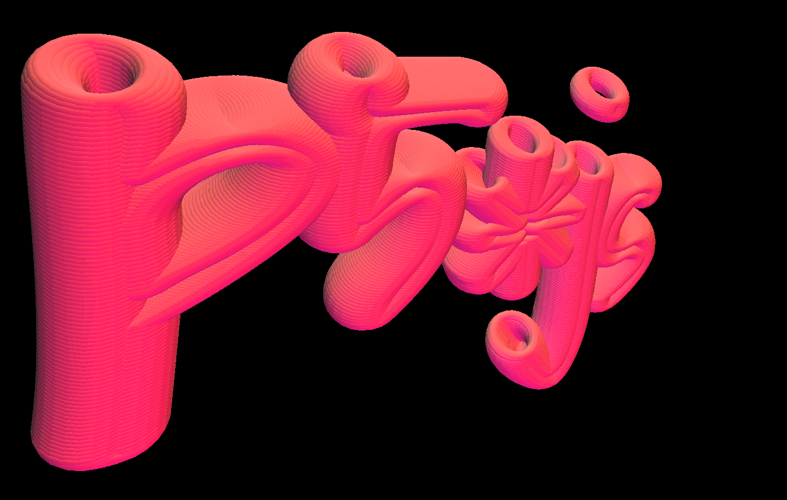
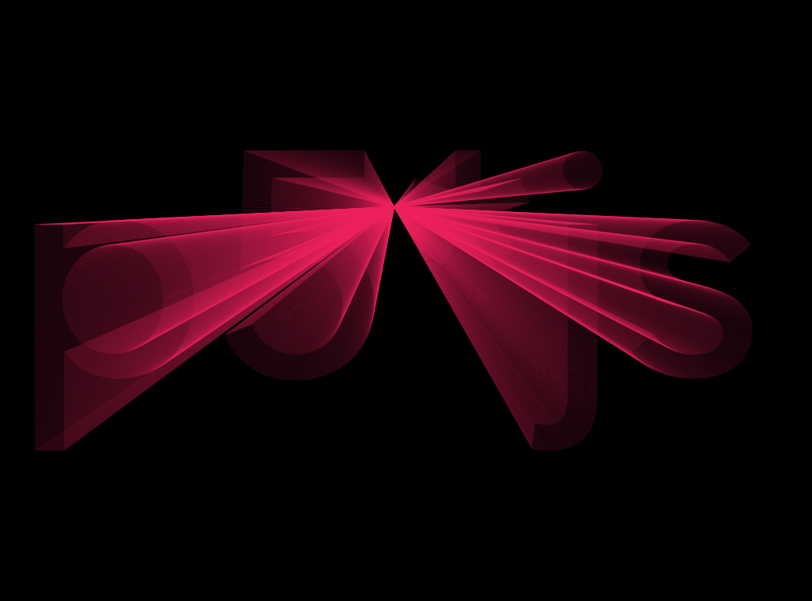
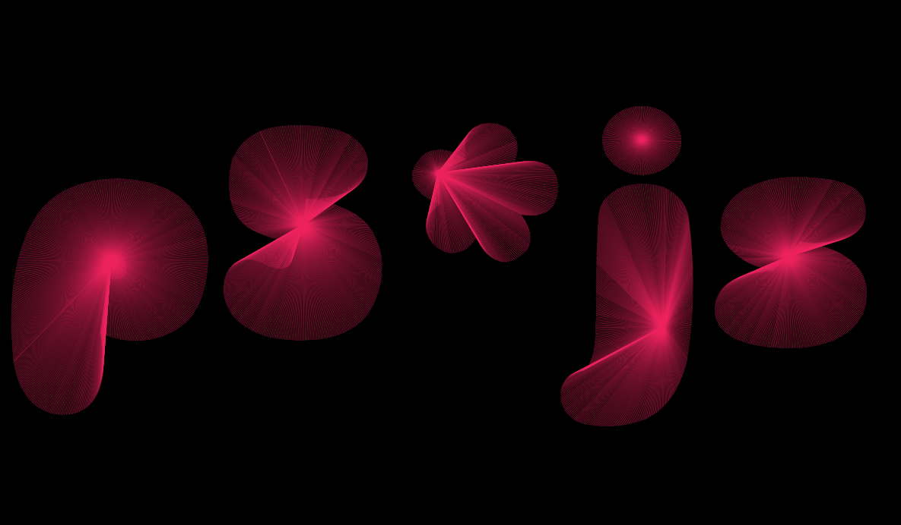
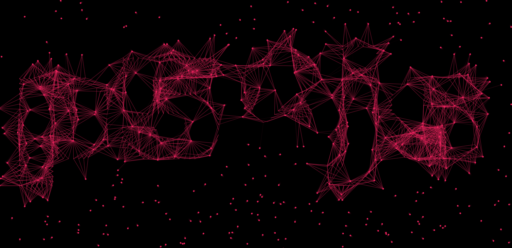
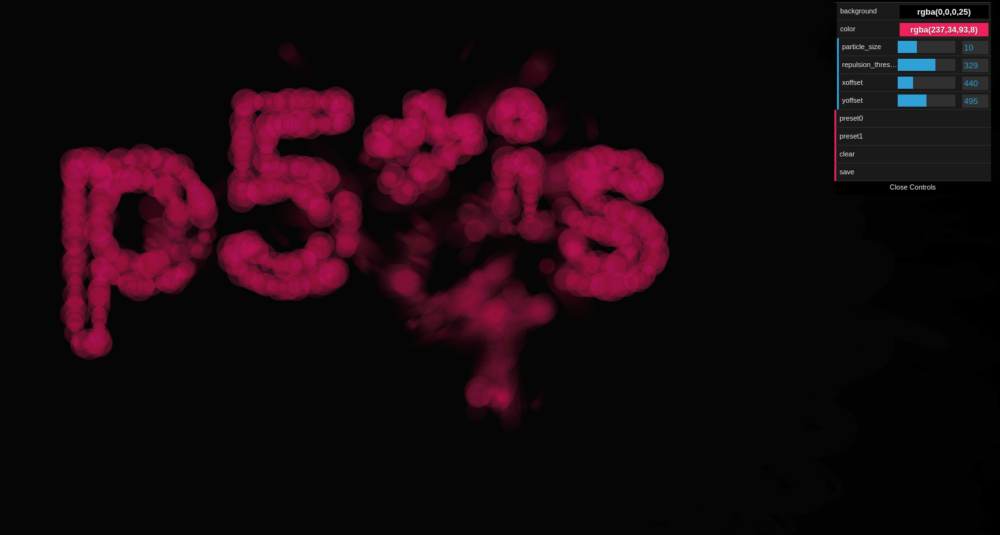
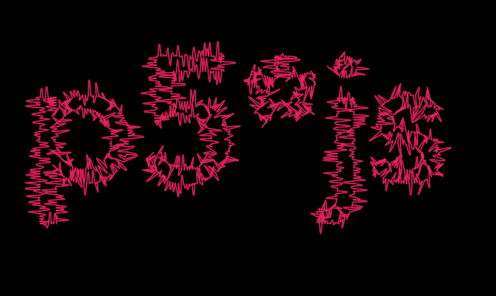
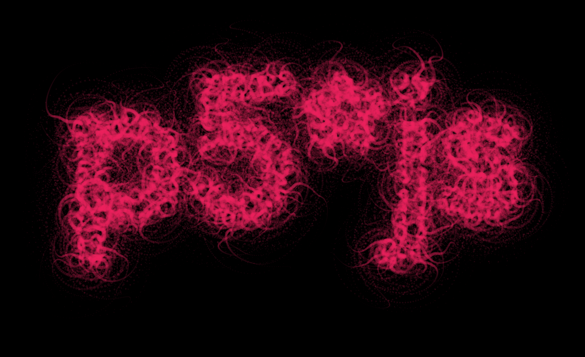

# p5js_typo


A repo to experiment (have fun) with typography using p5*js and Rune.font


## Interactive demos :

* light rays : https://b2renger.github.io/p5js_typo/light_rays/index.html
* spot lights : https://b2renger.github.io/p5js_typo/spot_lights/index.html
* 3d : https://b2renger.github.io/p5js_typo/3d/index.html
* particles lines : https://b2renger.github.io/p5js_typo/particles_lines/index.html
* particles attract / repel : https://b2renger.github.io/p5js_typo/particles_attract_repel/index.html
* scribble : https://b2renger.github.io/p5js_typo/scribble/index.html
* tentacles : https://b2renger.github.io/p5js_typo/tentacles/index.html

## Tools

### Drawing Framework

**p5xjs** 

http://p5js.org/

this is our drawing library, it's used to setup the page, the canvas, programm the behaviors of animated objects etc. The website is full of ressources and tutorial to learn, you can also check Daniel Shiffman youtube channel.

**scribble**

https://github.com/generative-light/p5.scribble.js

this is a library for p5xjs and is only used in one experiment. It's made to make your lines and other shapes look as if the were drawn by hand.


### Typographic library

**Rune** 

https://github.com/runemadsen/rune.js 

Rune is a full framework for graphic design. It is not limited to typography but we are using it mainly because of Rune.font addon and its support of paths.

**Rune.font** 

https://github.com/runemadsen/rune.font.js

Rune.font is plugin for Rune, it allows us to load a font and convert its outline to Rune.path objects or a series of polygons that we will be able to use withing p5xjs.

*Rune Madsen*, author of the Rune framework, has a great lecture about typography btw : http://printingcode.runemadsen.com/lecture-typography/


### Gui library

**dat.GUI** 

https://github.com/dataarts/dat.gui

dat.GUI is lightweight user interface library for js. It provides a collapsing drawer in which you can place sliders, buttons etc.


## Hands on tutorial

I will not explain in details how p5xjs works, there is plenty of ressources on the web about that. Hrere I will try to explain how to interface all our tools together.

First p5xjs uses two main functions

```javascript
function setup(){

}
``` 
and

```javascript
function draw(){

}
``` 

the *setup* is used to initialize all our variables, create a canvas etc. it is called once : on the loading of our page.
the *draw* is an infinite loop that runs until the page is closed.

A lot of the "boilerplate" code will happen in the former, whereas the actual drawing and interaction will happen in the later.

### Boilerplate code

the base of code used in the examples is a bit complex, our goal is :

1- to load a font, and analyse it using Rune.font to get a list of polygons we can use.

2- setup some gui elements to change the font and few parameters aswell as a button to regenerate the path.

Here is the code :

```javascript
var f;
var path;
var polys;
var drawing = false;
var gui, params;

function setup(){
    createCanvas(windowWidth,windowHeight)  // create a full screen canvas
    background(255)

    // init all parameters
    params = new Parameters();
    // create dat.gui drawer
    gui = new dat.GUI();
    // gui setup
    var f2 = gui.addFolder('configuration / path generation')
   
     // Configuration parameters
    // font selector
    f2.add(params, 'font', {Avenir : "../fonts/AvenirNextLTW01-Medium.woff", BlackOpsOne : "../fonts/Black_Ops_One/BlackOpsOne-Regular.ttf",
                            Comfortaa : "../fonts/Comfortaa/Comfortaa-Bold.ttf",
                            NovaMono : "../fonts/Nova_Mono/NovaMono.ttf", ShadowsIntoLight : "../fonts/Shadows_Into_Light/ShadowsIntoLight.ttf", 
                            Sniglet: "../fonts/Sniglet/Sniglet-ExtraBold.ttf",Tangerine : "../fonts/Tangerine/Tangerine_Bold.ttf",
                            UnicaOne : "../fonts/Unica_One/UnicaOne-Regular.ttf"});  
    f2.add(params, 'message');
    f2.add(params, 'spacing', 1, 25).listen();
    f2.add(params, 'size', 100, 1200).listen();
    f2.add(params, 'regenerate');

    // button
    gui.add(params, 'save')

    getPoints();
}

// this function loads a font, and create an array of polygons
// a polygon being itself an array of vectors with x/y coordinates
function getPoints(){
    drawing = false;
    // create new font : we use rune
    console.log(params.font);
    f = new Rune.Font(params.font) 
    // load the font
    f.load(function(err){       
        path = f.toPath(params.message, 0, 0, params.size)
        polys = path.toPolygons({ spacing:params.spacing })
        drawing = true;
    });
}

var Parameters = function(){

    this.font = "../fonts/AvenirNextLTW01-Medium.woff"
    this.message = 'p5*js';
    this.spacing = 2;
    this.size = 400;

    this.regenerate = function(){
        getPoints();
    }

    this.save = function(){
        saveCanvas()
    }

}
```

Quite a few things happened here, so let's break it down.

#### Loading a font and generating a path

First we create a few variables that will be handy.

```javascript
var f; // store the current font
var path; // store the path calculated from the current font
var polys; // store the array of polygons calculated from the current font
var drawing = false; // as loading is asynchron we need to keep track of its progression
var gui, params; // store gui related things.
```
The boolean **drawing** is used to know when the loading of the font is finished : when the font is loaded we have a path varaible that is not null aswell as an array of polygons. This variable is used in the **getPoints()**, it is set to *false* at the beginning, and set to *true* when the font is finally loaded.

So let's now have a look at the **getPoints()** function

```javascript
// this function loads a font, and create an array of polygons
// a polygon being itself an array of vectors with x/y coordinates
function getPoints(){
    drawing = false;
    // create new font : we use rune
    console.log(params.font);
    f = new Rune.Font(params.font) 
    // load the font
    f.load(function(err){       
        path = f.toPath(params.message, 0, 0, params.size)
        polys = path.toPolygons({ spacing:params.spacing })
        drawing = true;
    });
}
```
it's pretty straight forward, and it runs with minimal changes from the Rune.font documentation example :

http://printingcode.runemadsen.com/examples/typography/font/

we have a callback for when the loading is actually finished. When it's done we can actually draw. However you'll notice that I use things like *params.font*, *params.spacing* instead of the "hardcoded values from the Rune documentation. This is because of the dat.GUI implementation for parameters. 

#### Gui creation

The main ressource to learn dat.GUI is located here for further references : http://workshop.chromeexperiments.com/examples/gui/#1--Basic-Usage

Our boilerplate code involves being able to switch fonts, change the size of the message we want to display, and the spacing of points on the outline of the fonts. Those parameters can be changed via a gui, and once you are set you can click on *regenerate* to recalculate the **path** and the **polys** variable.

To do that dat.GUI is pretty easy. The variable named **gui** represents the things that will be displayed in the control drawer, whereas the variable named **params** is a javascript object that will simply hold our parameter values.

First let's concentrate on params, on the setup we just have this line to initialize our object.

``` javascript
    // init all parameters
    params = new Parameters();
```

and further on the code we have the actual object with its default parameters, which is just a data structure :

```javascript
var Parameters = function(){

    this.font = "../fonts/AvenirNextLTW01-Medium.woff"
    this.message = 'p5*js';
    this.spacing = 2;
    this.size = 400;

        this.regenerate = function(){
        getPoints();
    }

    this.save = function(){
        saveCanvas()
    }

}
```
dat.GUI will infer the kind of object it draws from the values of the varaibles. So the message by default is "p5xjs" but you can change it you will however need to click on the button *regenerate* to call the **getPoints()** function again to re-generate the path and our array of polygons. Since **this.regenerate** is a function it will be displayed as a button and once you click it you execute the code in-beetween the brackets.

The filling of our control drawer is done in the **setup()** function :

``` javascript
    // create dat.gui drawer
    gui = new dat.GUI();
    
    // gui setup
    var f2 = gui.addFolder('configuration / path generation')
```
with the second line of code, we create a specific group of controls **f2** in our gui, which will be called 'configuration / path generation'. We will now add elements to this specific folder of controls.
   
First a font selection object :
```javascript
    f2.add(params, 'font', {Avenir : "../fonts/AvenirNextLTW01-Medium.woff", BlackOpsOne :     "../fonts/Black_Ops_One/BlackOpsOne-Regular.ttf", Comfortaa : "../fonts/Comfortaa/Comfortaa-Bold.ttf",
NovaMono : "../fonts/Nova_Mono/NovaMono.ttf", ShadowsIntoLight : "../fonts/Shadows_Into_Light/ShadowsIntoLight.ttf", 
Sniglet: "../fonts/Sniglet/Sniglet-ExtraBold.ttf",Tangerine : "../fonts/Tangerine/Tangerine_Bold.ttf", UnicaOne : "../fonts/Unica_One/UnicaOne-Regular.ttf"});  
```
when you pass a json-like object to the **.add()** function it will create a dropdown list with each *key* appearing as an element of the list.

we arleady mentionned *message* and *regenerate* entries, so we are left with the later two :
```javascript
    f2.add(params, 'spacing', 1, 25).listen();
    f2.add(params, 'size', 100, 1200).listen();
```
those will be sliders as **params.spacing** and **params.size** are numeric value, you can then pass the lower and higher bounds as arguments. 

You can also notice the **.listen()** which will make the gui elements listen to the changes that would come from the programm. It can be usefull when creating presets - for instance in the "tentacles" example.


### Drawing code

We now have the basics for our code base. All we have to do now is actually draw.

In most of the example, some "drawing" things are already happening in the **getPoints()** function because we want to create a collection of objects (in the sense of oop objects) that take the coordinates of each point of each polygon. In that case the drawing is merely about creating a **for** loop that runs through our collection and calls the appropriate behavior.

But we can also simply iterate through our array of polygons to draw a shape on each spot... something like :

```javascript
for (var i=0; i < polys.length ; i++){
           var poly = polys[i];
           for(var j = 0; j < poly.state.vectors.length; j++) {
                var vec1 = poly.state.vectors[j];
          
                noFill()
                stroke(255);
                strokeWeight(1);
                scribble.scribbleEllipse(vec1.x, vec1.y,25,25);   
           }
}                
```

## Examples details 

### 3d


### light rays


### spot lights


### particle lines


### particles attract repel


### scribble 


### tentacles



